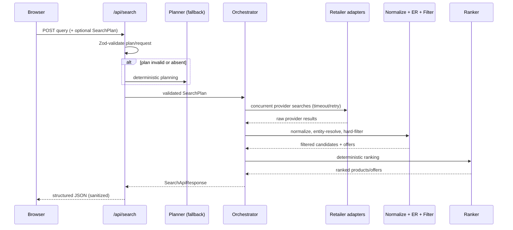

# Architecture — Emporika

> Narrative architecture detail also lives in the README (Architecture, End-to-End Request Flow, Entity Resolution, Ranking Engine). This document focuses on the structural map, entry points, and confirmed flows. If this doc and the README ever disagree, verify against code before trusting either.

## System overview

Emporika is a federated shopping search engine. The browser submits a natural-language query (optionally with a WebLLM-generated `SearchPlan`); the server validates the plan (or falls back to deterministic planning), searches eligible retailers concurrently, normalizes results, entity-resolves duplicates across retailers, applies deterministic hard filters, ranks deterministically, and returns structured results.

WebLLM is progressive enhancement: the deterministic planner in `search/planner.ts` is always sufficient. The LLM never determines final rank — `search/ranker.ts` is the single source of truth.

## Major components

| Component | Location | Responsibility |
|-----------|----------|----------------|
| Search orchestrator | `search/orchestrator.ts` | Owns the pipeline: validate plan → select providers → fan out → normalize → filter → rank → respond |
| Planner (fallback) | `search/planner.ts` | Deterministic natural-language parsing into `SearchPlan` |
| Zod schemas | `search/schemas.ts` | Validation at every boundary (`SearchPlan`, request/response) |
| Provider adapters | `search/providers/adapter.ts` | Uniform `RetailerSearchProvider` interface over retailer clients |
| Capability registry | `search/providers/capabilities.ts` | Declares what each provider supports; unsupported filters are reported, never faked |
| Normalization | `search/normalize.ts`, `search/offer-normalize.ts` | Map provider results to common candidate/offer shapes |
| Entity resolution | `search/entity-resolution.ts` | Title-similarity merging across retailers (thresholds: >90% medium, >75% low; never merges differing models/generations/variants) |
| Filtering | `search/filter.ts` | Deterministic hard constraints (price, condition, availability, brands, features) |
| Ranker | `search/ranker.ts` | Deterministic weighted criteria scoring with stable tie-breakers |
| Retailer clients | `lib/bestbuy.ts`, `lib/ebay.ts`, `lib/target.ts`, `lib/walmart.ts`, `lib/costco.ts`, `lib/shopify.ts` | API access, auth, and request signing (server-side only) |
| WebLLM adapters | `lib/webllm/` (`types.ts`, `client.ts`, `mock-adapter.ts`, `real-adapter.ts`, `prompts.ts`, `worker.ts`) | Browser-local query planning; mock adapter is active by default |
| Costco cookie cache | `lib/costco-cookie-cache.ts`, `lib/costco-cookie-fetcher.ts` | In-memory session cookie cache (2h TTL, dev-mode global) |
| Telemetry | `search/telemetry.ts` | Structured per-request logs: phases, provider errors, timing |
| UI | `app/page.tsx`, `components/` | Search UI, filters, product cards, cart, trending, PWA |

## Entry points

### Pages

- `app/page.tsx` — main search UI
- `app/layout.tsx` — root layout
- `app/offline/page.tsx` — PWA offline page

### API routes

| Route | Method | Purpose |
|-------|--------|---------|
| `/api/search` | GET / POST | Simple (GET) and intelligent (POST) search |
| `/api/trending` | — | Trending products feed |
| `/api/target/nearest-store` | — | Nearest Target store lookup |
| `/api/shopify/cart` | — | Shopify cart operations |
| `/api/costco/set-cookie` | POST | Store Costco session cookie |
| `/api/costco/refresh-cookie` | GET | Refresh Costco session cookie |
| `/api/cron/refresh-costco` | GET | Cron entry point; `Authorization: Bearer <CRON_SECRET>` when `CRON_SECRET` set |

## Request flow

## State management and persistence

- **Cart**: client-side React state in `context/CartContext.tsx`; no server persistence observed.
- **Costco cookies**: in-memory cache (module singleton + dev-mode `global.__costcoCookieCache`); not persisted across server restarts — hence the refresh cron.
- **Everything else**: stateless request-scoped processing. No database, no cache service.

## External service integrations

- Retailer APIs: Walmart, Best Buy, Target, eBay, Costco (all server-side clients in `lib/`).
- Shopify Global Catalog MCP (`lib/shopify.ts`) — auth via `SHOPIFY_CLIENT_ID`/`SHOPIFY_CLIENT_SECRET`; agent profile fetched during negotiation (`SHOPIFY_AGENT_PROFILE`, `/ucp-agent-profile.json`).
- Vercel Cron (defined in `vercel.json`) — hourly Costco cookie refresh.

## Authentication/authorization

- **eBay**: OAuth client-credentials flow (`EBAY_CLIENT_ID`/`EBAY_CLIENT_SECRET`; `EBAY_SANDBOX` switches environment).
- **Walmart**: signed requests (`WALMART_PRIVATE_KEY_BASE64`, `WALMART_KEY_VERSION`).
- **Cron route**: bearer token when `CRON_SECRET` is set.
- **Browser ↔ server**: no user auth layer; API responses are sanitized `SearchApiResponse` JSON.

## Observability and error handling

- `search/telemetry.ts` — structured per-request logging (request ID, phase timings, provider errors, candidate counts).
- `search/errors.ts` — typed error classes for pipeline failures.
- Adapters surface partial failures via `metadata.unsupportedFilters` and provider error records rather than throwing away whole searches.

## Assumptions and unknowns

- Primary hosting is ambiguous: Netlify config/docs exist, but `vercel.json` defines the Costco cron. See AGENTS.md "Known Unknowns".
- The tracked `WM_IO_my_rsa_key_pair` (encrypted RSA private key) has unknown provenance; its presence in history is a security concern.
- WebLLM real adapter (`lib/webllm/real-adapter.ts`, `worker.ts`) exists but the mock adapter is active — the exact handoff to the real adapter is untested in this session.
